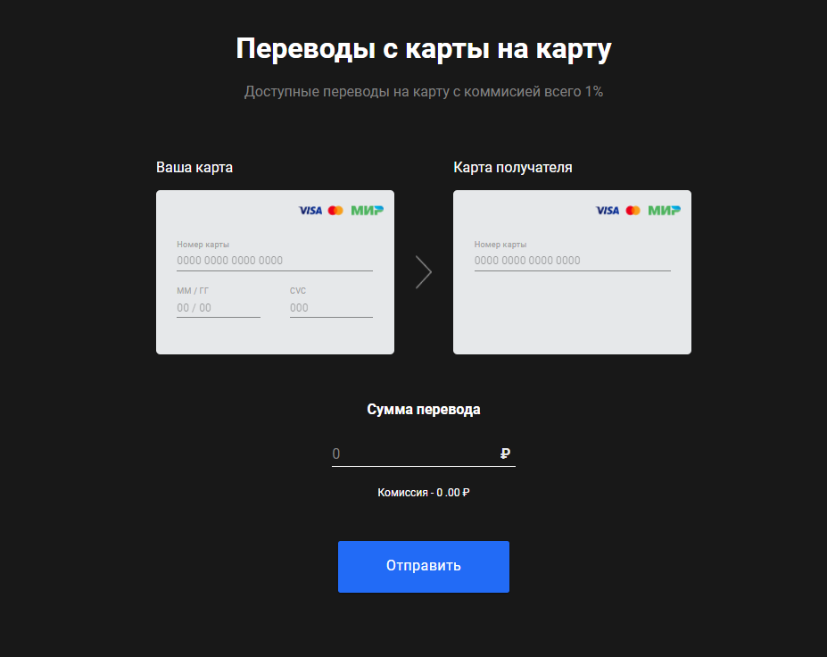
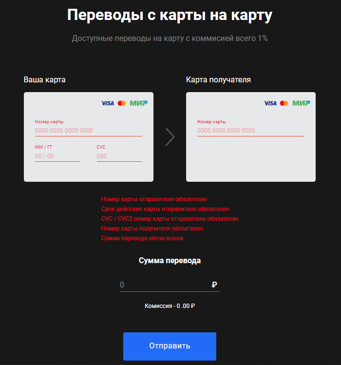
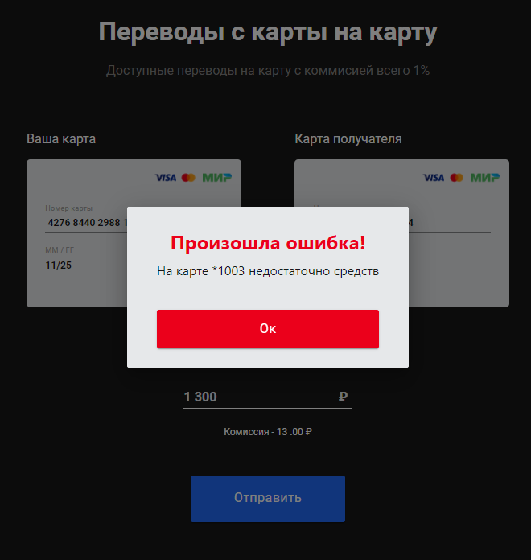
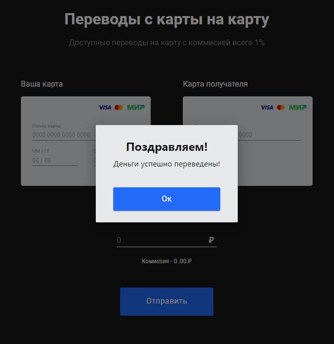
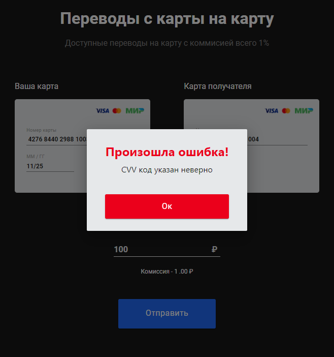

# Сервис перевода денег с карты на карту.
Демо FRONT тут:  
https://serp-ya.github.io/card-transfer/  
### Как работает FRONT:  
   Пользователь вводит данные своей карты (номер, срок действия, CVV) и номер карты получателя перевода. Указывает размер перевода в RUB. Сервис рассчитывает комиссию и осуществляет перевод + вычет коммисии.   

## Описание серверной части
REST-сервер принимает POST запрос на порт 5500 и путь /transfer. Тело запроса и ответа в формате json. Запрос состоит из: 
- номер карты отправителя(String), 
- срок действия карты(String), 
- CVV(String), 
- номер карты получателя(String), 
- размер списания(Object: сумма(int) + описание валюты(String)).

Если *не указынны*: номера карты отправителя, либо получателя, либо код CVV, либо срок действия, либо сумма или срок действия карты истёк FRONT отобразит соответсвующее сообщение:   
   
Сервер принимает тело запроса в виде валидированного объекта TransferTransaction.   
Далее проверяется карта отпрваителя на соответствие в базе данных. Если номер, срок действия, CVV совпадают, то из БД возварщается объект Card. Более простая проверка у получателя по номеру карты - тоже возвращается объект Card.   
Если эти карты найдены, то производим саму транзакцию: рассчитываем размер коммисии, далее проверяем есть ли сумма с учётом комиссии на карте отправителя.   
Если суммы нет - сервер выбрасывает соответствующее исключение:   
  
 
Есть сумма -  уменьшаем сумму на карте отправителя и увеличиваем сумму на карте получателя:   

## Exceptions
Для отображения исключений на FRONT создаем класс ExceptionAdvice. В нём будут содержаться все ExceptionHandler для обработки исключений.
Если номера карты отправителя платежа нет, либо не совпадает код CVV или срок действия, сервер вернёт соответсвующее исключение.   

